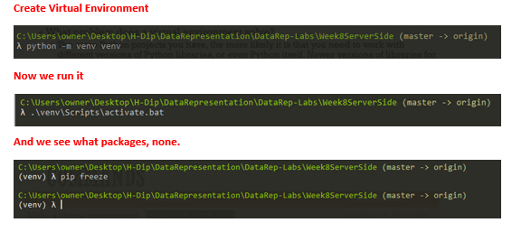
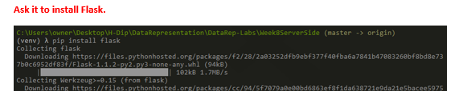

# Data-Representation-Project

Create a Web Application with a basic Flask server that has a REST API, (to perform CRUD operations) on one database table, and an accompanying web interface, using AJAX calls, to perform these CRUD operations.

Getting Started. 

- 1. Creating a virtual environment. 

Main purpose of Python virtual environments is to create an isolated environment for Python projects. This means that each project can have its own dependencies, regardless of what dependencies every other project has. They are useful in controlling what Python modules are installed.

 

 

 

To exit run the following command "deactivate". 

- 2. Create Flask Server with Rest API. 

This will perform CRUD operations. 