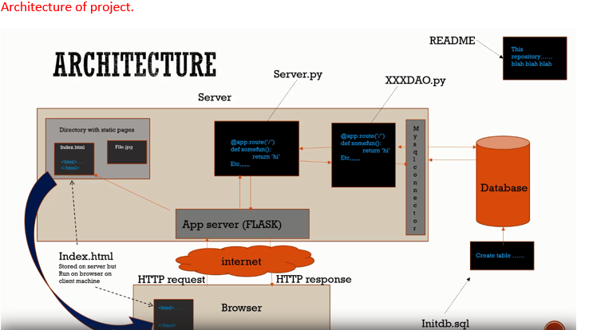

# David Markham 
# Data Representation 
# G.M.I.T.
# Lecturer: Andrew Beatty
# Data-Representation-Project

Create a Web Application with a basic Flask server that has a REST API, (to perform CRUD operations) on one database table, and an accompanying web interface, using AJAX calls, to perform these CRUD operations.

 

### For this project I will be using a DVD rentals database with two tables, customer and dvds.

### Steps

1. Create a <a href="https://github.com/daithimarkham/Data-Representation-Project/blob/main/requirements.txt">Virtual Environment</a>, requirements.txt etc. 

2. Using python, create a <a href="https://github.com/daithimarkham/Data-Representation-Project/blob/main/createDatabase.py">database</a> with tables using MYsql. We will use two tables for this project. 
3. Create <a href="https://github.com/daithimarkham/Data-Representation-Project/blob/main/dbconfig.py">dbconfig.py</a> file, this is the code necessary to connect to mysql, and what database to use.
4. Create <a href="https://github.com/daithimarkham/Data-Representation-Project/blob/main/DvdDAO.py">DAO file</a> (Data Access Object), this will hold all the specific data operations without exposing details of the database. Manages the connection with the data source to obtain and store data.
5. Create a <a href="https://github.com/daithimarkham/Data-Representation-Project/blob/main/testDvdDAO.py">test DAO file.</a>
6. Create a <a href="https://github.com/daithimarkham/Data-Representation-Project/blob/main/DvdServer.py">Restful API</a> Crud operation, and import Flask module. API means Application Programming Interface, and It is a set of routines, protocols, and tools for creating software applications. An API interface makes communication possible between various software components. It manages all the data for the web application through HTTP requests and manages the CRUD operations.
- Get 
- POst
- Update
- Delete
7. Create a <a href="https://github.com/daithimarkham/Data-Representation-Project/blob/main/static/DvdServer.html">HTML</a> page for your server. CRUD operation will be done here.

### How to run it?

- Clone down this repository to your machine. 
- You will need an Anaconda environment to run it. 
- To see what packages you will need exactly, you can go to the requirements.txt file. 
- If you follow the steps above, this will hopefully help you run the application.
- Once you have all the steps done above, to run the application you can do the following. 

1. Run the DvdServer.py file. 
2. Then copy the http address which will be displayed in your terminal and paste in your browser.
3. From here you run it, and perform different CRUD commands on it on the details from the SQL database. 

### Extra functionality 

- Add a <a href="https://github.com/daithimarkham/Data-Representation-Project/blob/main/static/login.html">Login</a> Page.
- Host online for eg. PythonAnywhere 
- Make page look nice.
- Can use a more complicated API.
- Add in numerous tables. 
- Linking to some third part API, and if so, it might require authentication. 

### References 

Andrew Beatty Lectures, Data Representation & Querying, 2020, viewed on 2021/01/05, available online at: https://github.com/andrewbeattycourseware/dataRepresenation2020 

